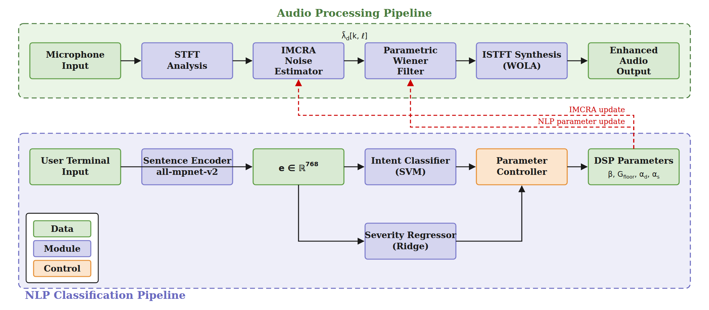

# Intention-Based Speech Enhancement for Hearing Aids Using NLP

Real-time speech enhancement whose DSP parameters are controlled by what the
user says, in plain language.

BSc thesis — Technical University of Denmark (DTU), Electrical Engineering, in
collaboration with Oticon.

---

## The problem

When something sounds wrong, a hearing aid user does not think in gain or
noise-suppression strength. They think *"the background noise is too much"* or
*"voices sound muffled"*. The device needs a technical parameter, not a symptom
description.

That mismatch is what this project addresses — and it is becoming harder to
avoid. As devices shrink toward completely-in-canal designs there is no room for
physical controls, so adjustment must happen through an app or by voice.

**The question: can natural language itself serve as the control interface?**

## System architecture

<p align="center">
  
</p>

Two pipelines run concurrently. The **audio pipeline** (top) enhances the
microphone signal frame by frame and never blocks. The **NLP pipeline** (bottom)
turns a typed complaint into an intent class and a severity score, which the
parameter controller converts into DSP updates — the red paths — applied to the
running audio without interrupting it.

The vector source is [`docs/system_architecture.svg`](docs/system_architecture.svg).

## Installation

```bash
git clone https://github.com/oliburr10/Intention_based_speech_enhancment_using_NLP.git
cd Intention_based_speech_enhancment_using_NLP

python -m venv .venv && source .venv/bin/activate   # Windows: .venv\Scripts\activate
pip install -e '.[all]'
```

Requires Python 3.10+. The `[all]` extra pulls in `sentence-transformers` for the
embedding model and `sounddevice` for audio I/O.

## Usage

**1. Train the NLP models.** Downloads `all-mpnet-base-v2` (110M parameters) on
first run and writes the fitted classifier and severity scorer to
`artifacts/models/`, alongside result tables and figures.

```bash
intent-se-train --output-dir artifacts
```

**2. Run the system on your soundcard.**

```bash
intent-se-run --list-devices          # print every device with its index
intent-se-run --device 3              # same interface for mic and headset
```

If the hearing aid microphone and the headset are on different interfaces,
name them separately:

```bash
intent-se-run --input-device 3 --output-device 5
```

Either argument takes an **index** (`3`) or a **name substring**
(`'Fireface'`). On startup the resolved devices are printed, so the routing
that produced a given session is visible in the log:

```
Audio devices:
  input : [3] Fireface UC (24 in / 24 out, default 48000 Hz)
  output: [5] Headphones (0 in / 2 out, default 48000 Hz)
```

### Hardware setup

The system was developed against an **RME Fireface UC at 48 kHz**, which
delivers 512 samples per callback — the constraint every other frame size
follows from. `--blocksize` accepts other values; the analysis window and FFT
size scale with it to preserve the 50% overlap.

> **Record your own device indices here.** They are assigned by the operating
> system and change when interfaces are plugged in or removed, so run
> `--list-devices` and note what the mic and the headset came back as:
>
> | Role | Device | Index | Channels used |
> |---|---|---|---|
> | Hearing aid microphone | _e.g. Fireface UC_ | _?_ | _?_ |
> | Headset | | | |

Only the first two input and first two output channels of the selected device
are used. On a multichannel interface, route the microphone and headset to the
first pair in the device's own mixer (TotalMix on the Fireface).

Audio streams continuously while you type complaints. Each sentence is embedded,
classified, scored for severity, and turned into a DSP parameter update that
takes effect immediately on the running stream:

```
> the background noise is unbearable
    [applied] TOO_NOISY (severity 0.94, confidence 0.98) -> beta=1.940, gain_floor=0.012, ...
> now voices sound muffled
    [applied] SPEECH_UNCLEAR (severity 0.61, confidence 0.96) -> beta=1.635, tilt=1.830, ...
> :params
> :quit
```

## Repository layout

```
src/intent_se/
├── config.py            every tunable parameter, with its justification
├── audio/
│   ├── stft.py          sliding buffer, sqrt-Hann windows, WOLA reconstruction
│   ├── imcra.py         IMCRA noise PSD estimation + pre-roll seeding
│   ├── wiener.py        parametric Wiener filter (β is the NLP-tunable knob)
│   └── pipeline.py      the real-time enhancer and soundcard callback
├── nlp/
│   ├── dataset.py       loading, validation, stratified splitting
│   ├── embeddings.py    all-mpnet-base-v2 sentence embeddings
│   ├── classifier.py    five classifier candidates + selection protocol
│   ├── severity.py      Ridge regression severity scorer
│   └── evaluate.py      confusion matrix, t-SNE, result tables
├── control/
│   └── parameter_probe.py   exploratory: do the parameters respond? (unfinished)
└── cli/
    ├── train_nlp.py     trains and evaluates the NLP models
    └── run_realtime.py  live system: soundcard + typed complaints

data/complaints_v4.csv   1106 labelled complaint sentences
```

---

## Real-time audio pipeline

### Frame sizes

The chain starts from a hardware constraint; everything else follows from it.

| Parameter | Value | Reason |
|---|---|---|
| Callback block | 512 | Imposed by the RME Fireface UC soundcard |
| Window `Nw` | 1024 | Frequency resolution needed by the STFT |
| Hop `H` | 512 | `= Nw/2`, exactly the 50% overlap WOLA requires |
| FFT size | 2048 | Zero-padding, for finer bin interpolation |
| Bins | 1025 | `n_fft/2 + 1` |

Two size doublings happen, doing different jobs. **512 → 1024** is time-domain
buffering: a sliding buffer accumulates enough samples for a full window.
**1024 → 2048** is frequency-domain zero-padding, so IMCRA and the Wiener filter
see a higher-resolution spectrum and produce smoother gain curves. The padding is
discarded after the inverse FFT.

### Perfect reconstruction

The analysis window is the square root of a periodic Hann window, applied again
at synthesis. Their product is one full Hann window, and at 50% overlap a Hann
window sums to exactly 1.0 across the two overlapping frames — the WOLA
condition. Without it, overlapping contributions do not sum cleanly and the
output carries amplitude ripple that sounds like distortion.

The system verifies this at startup:

```python
>>> from intent_se.audio import SpeechEnhancer
>>> SpeechEnhancer().self_test()
4.44e-16
```

### IMCRA noise estimation

The Wiener filter needs the noise power in each bin *right now*, and noise is
never directly observable apart from speech. A hard voice activity detector makes
a binary decision that, when wrong, either stalls the estimate or corrupts it
with speech energy. Plain minimum statistics adapts slowly and cannot tell a
rising noise floor from sustained speech.

IMCRA combines minimum tracking with a soft per-bin speech-presence probability
that controls adaptation speed — fast when speech is unlikely, frozen when it is
likely. Parameters follow Cohen (2003); the minimum-search window is
`D = U × V = 8 × 15 = 120` frames.

**Cold-start handling.** The estimator is recursive, so at startup its buffers
are zero and the estimate is badly wrong — in practice the system suppressed
everything or nothing for the first few seconds. The fix is pre-roll noise floor
seeding: the first 5 frames are captured unfiltered and their per-bin *minimum*
initialises the buffers. The minimum rather than the mean, so a transient during
pre-roll biases the floor low rather than high — an estimate that starts too high
suppresses speech from the first frame, which is the more damaging failure.

### Parametric Wiener filter

The standard Wiener gain is `ξ/(1+ξ)`. Optimal under its assumptions, but
high-frequency bins usually have lower SNR, so the filter suppresses them hard
and starts behaving like a low-pass filter; and the curve is fixed, giving no
control over aggressiveness.

The parametric form introduces an exponent:

```
G(k) = ( ξ(k) / (1 + ξ(k)) ) ^ β
```

Low β flattens the curve and preserves high-frequency content; high β steepens it
and suppresses noise harder; **β = 1 recovers the standard filter exactly**.

**β is the parameter the NLP side controls.** A gain floor of 5% prevents any bin
being zeroed out completely, which is what produces musical noise. The a priori
SNR uses the Ephraim–Malah decision-directed estimator, since a purely
instantaneous estimate fluctuates between frames and takes the gain with it.

## NLP classifier

### Dataset

No public dataset exists for hearing-aid complaints with severity labels, so one
was built: **1106 sentences across six classes**, generated with large language
models, with linguistic diversity as an explicit goal.

| Class | Count | Meaning |
|---|---:|---|
| `TOO_NOISY` | 225 | Too much background noise |
| `SPEECH_UNCLEAR` | 194 | Cannot follow speech |
| `TOO_LOUD` | 175 | Overall volume too high |
| `TOO_QUIET` | 170 | Insufficient volume |
| `TOO_SHARP` | 167 | Harsh or shrill high frequencies |
| `BALANCED` | 175 | Satisfaction |

`BALANCED` earns its place: without it every utterance reads as a complaint and
the system keeps adjusting even when the user is happy.

Severity is continuous in `[0, 1]`, labelled by a four-level linguistic
heuristic — minimising language ("slightly", "barely") ≈ 0.05–0.25; intensive
("very", "constantly") ≈ 0.5–0.8; extreme ("unbearable", "cannot at all") ≈ 1.0.
`BALANCED` is always exactly 0. The vocabularies of `TOO_LOUD` and `TOO_SHARP`
are deliberately disjoint, since they are the easiest pair to confuse.

### Embeddings

`all-mpnet-base-v2` (768-dim) over `all-MiniLM-L6-v2` (384-dim). MiniLM is
smaller and faster, but mpnet scores higher on Sentence-BERT similarity
benchmarks — and that matters because several sentences sit near class
boundaries. *"I can't make out what people are saying"* could plausibly be
`TOO_NOISY` or `SPEECH_UNCLEAR`. Inference speed is not a bottleneck here, so
embedding quality wins. Vectors are L2-normalised, so cosine similarity reduces
to the dot product.

### Classifier selection

Five candidates spanning simple to complex — logistic regression, linear SVM,
kNN (k=15, cosine), MLP (two ReLU layers), XGBoost. The spread answers a real
design question: **does the embedding space need non-linear boundaries, or has
the transformer already made the classes linearly separable?**

Selection protocol:

1. Five-fold stratified cross-validation on the development pool (train +
   validation, 940 sentences), scored by macro-averaged F1 — which weights all
   six classes equally, so a classifier gets no credit for the large classes
   while underperforming on the small ones.
2. The test set is used exactly once, after selection. That single use is what
   makes the reported score an unbiased estimate.
3. Ties are broken on generalisation, not raw accuracy.

### Severity scorer

Two users both classified `TOO_NOISY` — one says *"a barely noticeable background
hum"*, the other *"absolutely excruciating"*. Same class, very different
appropriate response. A fixed per-class adjustment either under-responds to
severe complaints or over-responds to mild ones.

Ridge regression on the same embeddings, running in parallel with the classifier.
Ridge rather than OLS because with ~930 samples and 768 features `N ≈ D`, where
OLS fits the training data closely and generalises poorly. Alpha is selected by
cross-validation on MAE.

This component was an addition beyond the original project proposal, made after
it became clear that purely categorical intent mapping was too rigid for a system
meant to respond proportionally to the user's discomfort.

## Results

| Classifier | CV macro-F1 | val→test drop |
|---|---:|---:|
| Logistic regression | 0.964 | 0.036 |
| **Linear SVM** ★ | **0.964** | **0.005** |
| MLP | 0.950 | 0.043 |
| XGBoost | 0.940 | — |
| kNN | 0.917 | — |

**Both linear classifiers beat all three non-linear ones.** That is the
substantive finding: the sentence transformer had already organised the six
classes into linearly separable regions, so a linear boundary is not merely
sufficient but preferable — fewer assumptions, less overfitting on a dataset this
size. The t-SNE projection shows the same result from another angle.

Logistic regression and the SVM tied on cross-validation, so the tie went to
generalisation. The SVM's validation→test drop of **0.005** means its CV estimate
predicted test performance almost exactly. Logistic regression dropped 0.036; the
MLP dropped 0.043 despite the highest validation accuracy — slight overfitting.

**Selected: linear SVM, test macro-F1 = 0.957.**

Severity scorer: **α = 0.10**, cross-validation MAE **0.1002**. Best per class on
`TOO_LOUD` and `TOO_SHARP` (MAE ≈ 0.06); worst on `TOO_QUIET` (MAE ≈ 0.09), whose
sentences are too semantically similar across severity levels for the embedding
to separate mild from severe.

Where the classifier fails it fails gracefully: `TOO_SHARP` is the main error
source, and such a complaint handled as `TOO_LOUD` still moves the audio in a
perceptually reasonable direction.

## The open problem: mapping severity to magnitude

**This part of the system was not finished, and the repository does not pretend
otherwise.** `control/parameter_probe.py` is a probe, not a controller.

From the thesis:

> The major problem with the process of translating a user's complaint into a
> change of a parameter's value is that there is no mathematically accurate
> ground truth that relates a particular complaint to the corresponding value of
> that parameter. The general direction of each parameter manipulation can be
> understood through signal processing theory; for example, manipulating the
> suppression exponent β upwards in case the user complains about the noise will
> make the Wiener gain function grow steeper and hence suppress more strongly
> frequency bins that are affected by noise. However, since it is not possible to
> calculate analytically how strong the effect should be, there is an inevitable
> level of subjectivity in the relation between the numeric severity score of 0.6
> and 0.8 and the actual change of the parameter. For example, one user can be
> satisfied with either of those levels while the other feels a great difference
> between them.
>
> Due to time constraints, a complete perceptual validation and mapping of the
> parameters was not implemented. This remains as an open challenge for further
> work.

### What was established

The **direction** of each manipulation follows from signal processing theory:

| Intent | Direction |
|---|---|
| `TOO_NOISY` | ↑ β — steepen the gain curve, suppress noise bins harder |
| `SPEECH_UNCLEAR` | ↓ β — flatten it, preserve high-frequency detail |
| `TOO_LOUD` | ↓ broadband output gain |
| `TOO_QUIET` | ↑ broadband output gain |
| `TOO_SHARP` | ↓ high-frequency tilt |
| `BALANCED` | decay back toward defaults |

And that the path from a classified sentence through to the audio is intact:
driving β while the stream is running produces a clearly audible change in
suppression, exactly as the theory predicts. That is what the probe exists to
test — one parameter at a time, does moving it have the expected effect.

### What was not

Any calibrated relationship between a severity score and a step size. The
`probe_delta` values in `INTENT_ACTIONS` are **arbitrary steps chosen to be
audible but not destructive**, so that an effect can be heard at all. They carry
no perceptual meaning, and the linear severity → magnitude relation is a
placeholder rather than a finding.

Establishing the real mapping needs a structured listening study: recruiting
hearing-aid users, presenting controlled variations of each parameter across the
severity range, having them rate which adjustments felt appropriate, and fitting
a mapping function to the results. That is a research project in its own right,
and it is the most important next step for this work.

## Limitations

1. **The perceptual calibration study above** — the largest gap, and the reason
   the parameter mapping is a probe rather than a controller.
2. **The dataset is LLM-generated.** Real complaints are messier and more varied,
   and the severity labels reflect a single annotator's judgement rather than a
   standardised benchmark. Real-user speech recognition output will also be
   noisier than clean generated text.
3. **Compute.** `all-mpnet-base-v2` is 110M parameters and effectively wants a
   GPU — fine for a laptop proof-of-concept, far beyond embedded hearing-aid
   hardware. A product would need a distilled model, or the NLP offloaded to a
   paired smartphone.
4. **The interface is typed text.** A real deployment needs automatic speech
   recognition in front of the classifier.

None of these require rethinking the core architecture.

## References

- Cohen, I. (2003). *Noise spectrum estimation in adverse environments: improved
  minima controlled recursive averaging.* IEEE Trans. Speech and Audio
  Processing, 11(5), 466–475.
- Ephraim, Y. & Malah, D. (1984). *Speech enhancement using a minimum mean-square
  error short-time spectral amplitude estimator.* IEEE Trans. ASSP, 32(6).
- Reimers, N. & Gurevych, I. (2019). *Sentence-BERT: Sentence embeddings using
  Siamese BERT-networks.* EMNLP.
- Song, K. et al. (2020). *MPNet: Masked and permuted pre-training for language
  understanding.* NeurIPS.
- Loizou, P. (2013). *Speech Enhancement: Theory and Practice*, 2nd ed. CRC Press.

## License

MIT — see [LICENSE](LICENSE).
